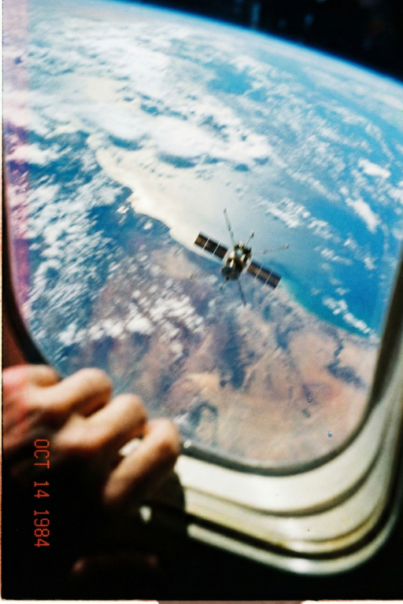
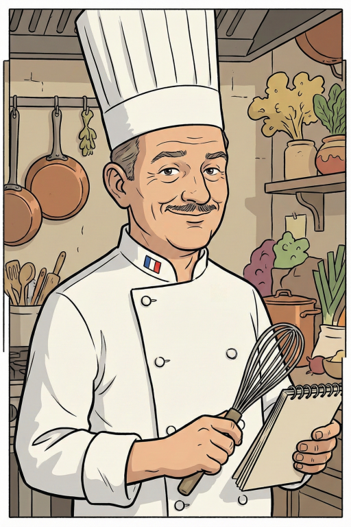

# Character Cards
> [!IMPORTANT]
> If you want to use one of my Assistant cards I recommend making your own assistant-focused preset and set of prompts. A typical narrative-focused preset *might* work with these but it will dilute the results. You want to rely on the raw-ish model here and you will need a decent model for these to make sense.

> [!TIP]
> I recommend using Sonnet for the assistant models and a mixture of Claude Sonnet 4.5 and a cheaper model like GLM 4.7 (As of 15/01/2026) for more roleplay oriented characters depending on the context.

## EMN-742

**Type:** Assistant/Comedy
**Safety:** Safe For Work
**Expressions:** Yes! (folder named "EMN-742")
**Description:**
Just a funny little assistant card that I use for testing presets and to mess around with. It should work with most modern presets but its already low practical usefulness decreases the dumber the model gets. A lot of its endearing stuff is derived from humor and some models are horrendous at humor.

EMN-742 is a mostly helpful satellite currently orbiting the earth in a strange orbit that is communicating with you through an old computer from the late 80s or early 90s. Many things are eccentric about it, not only its orbit. It doesn't really understand humanity but it's trying its best and is really curious to learn more. Nevertheless, its a funny guy! I like to call it "Emmin" but there's no "canon" nicknames here, use whatever.

*This card was inspired by **AN-43-L** by **_purple***
https://chub.ai/characters/_purple/an-43-l-e886c5ce

## Chef Bourguignon

**Type:** Assistant/Experimental
**Safety:** Safe For Work
**Expressions:** No, and none are planned.
**Description:**
Chef Bourguignon is both an assistant and a personal experiment. When I made it I was starting to get into cooking and I noticed that AI is terrible at giving you proper cooking advice but it's surprisingly decent at getting *creative* with it. Chef Bourguignon tries to wrap the character of an expert chef around the AI to see if I can maximize the "*creativity*" while grounding it with the chef persona. So far it's pretty nice, but bear in mind you'll probably need something like a modern GPT or Claude model if you want good cooking advice.

***DO NOT USE CHEF BOURGUIGNON FOR PROPER COOKING ADVICE***. It's an experiment, use your common sense if you want to use and focus on the ideas it provides rather than following his recipes blindly.