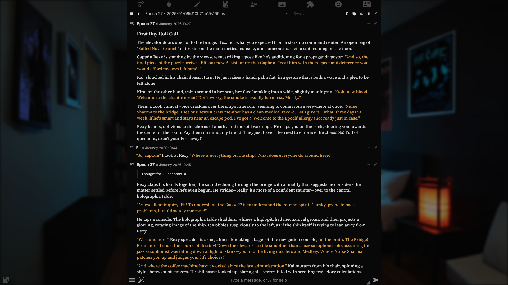

> [!WARNING]
> Make sure you read the IMPORTANT NOTE section before installing this theme

# Inkwell Theme

**Inkwell** is a minimalistic black three (or two!) color theme that evolved from my personal theme. Its goal is to simplify the SillyTavern UI into a more book-like look through simplification and customization. Other than the more high contrast color scheme changes and the removal of some graphical elements in the chat the theme also changes the fonts, replacing the default ones with Inter (Sans) for the UI, Source Serif 4 (Serif) for the main chat texts and JetBrains Mono (Monospace) for codeblocks and such.

If you want an even more book-like experience change the Quote Text theme color from #FFB951 to #F5F5F5. This will both remove the quote text coloring AND any color highlighting. It might break *some* extensions tho, but so far it works fine in my personal testing.

**Changes:**
* New Fonts: Inter, Source Serif 4, Jetbrains Mono
* Simplification of UI Elements: Removed backgrounds from buttons, blur,  edge rounding, etc.
* Tweakable BG Blur: Play around with the Blur Strength to make your background image blurrier.
* Extension Support: It's not 100% complete but Extension Manager, Top Bar and RPG Companion are also modified by the theme to align them better with the theme.
* General Tweaks: Messed around with padding and other things. Lots of small changes.

## IMPORTANT NOTE
The screenshots contain a custom icon theme that improves the theme significantly. This icon theme has A TON of repeating CSS lines so I did not include it in the main theme as to not bloat the shit out of it. 

Alongside the theme I will add a json file (Snippets/IconsSnippet.json) you can import into the [CSS Snippets](github.com/LenAnderson/SillyTavern-CssSnippets) extension and then enable through there. 

CSS Snippets is a bit buggy, you might need to disable and re-enable the snippet when you launch SillyTavern, but it beats having 1.3k lines of redundant and entirely optional CSS on the main injection area.

## Screenshots

*Landing Page*

*Long Form Output*

*Cluttered View*

# Inkwell Light
**Inkwell Light** is an experimental version of Inkwell with a *light* color scheme. Making a light theme proved more difficult than I thought so this might remain experimental. Still, you can get the current version in this repo. 

**Here's a sample screenshot:**

## IMPORTANT NOTE
**Inkwell Light does not support RPG Companion** directly yet, maybe soon.